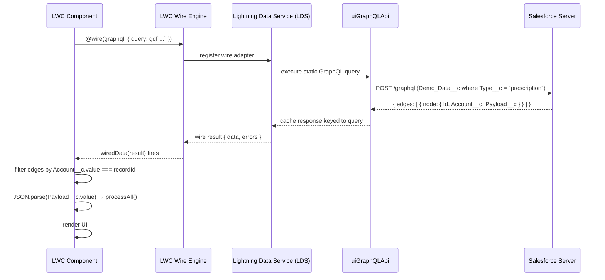
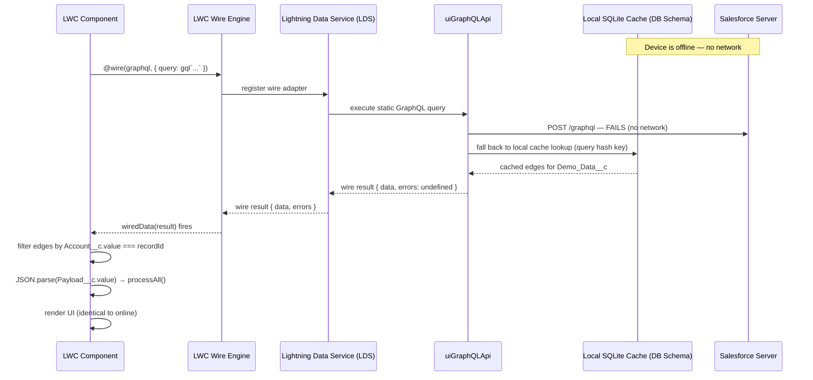
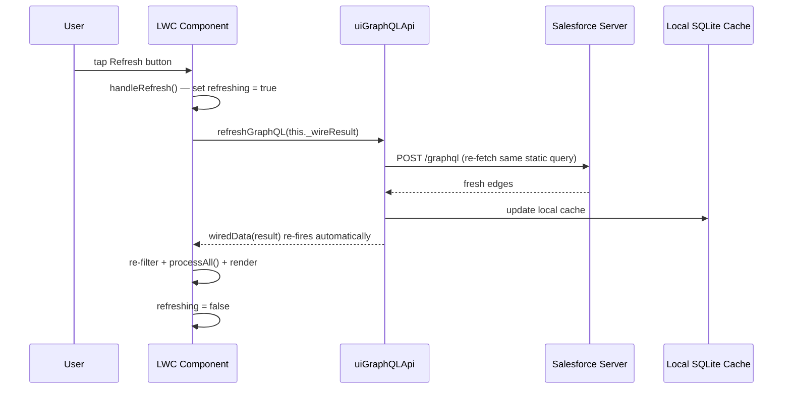
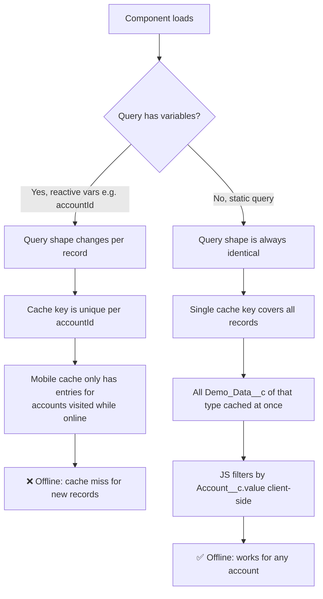

# LWC Migration: Apex Wire → GraphQL (Offline-Ready)

> **Disclaimer:** This repository is not an official Salesforce product and is not supported or endorsed by Salesforce. It is provided **AS IS**, without warranty of any kind, express or implied. Customers and system integrators are solely responsible for testing, validation, and due diligence before use in any environment.

## Overview

The five `lscMobileInline_*` components were originally built using `@wire` against Apex methods (`DemoDataLoader.getDataForAccount`, `DemoDataLoader.getDataByType`). While this works well online, Apex wire calls are **not supported in the Salesforce Mobile offline cache** — the LWC engine cannot replay them when the device has no network connection.

This document describes the changes made to each component to make them work both **online and offline** using `lightning/uiGraphQLApi`.

---

## Components Migrated

| Component | Data Type | Wire Count |
|---|---|---|
| `lscMobileInline_rxTrend` | `prescription` | 1 |
| `lscMobileInline_spDispensing` | `specialty_pharmacy` | 1 |
| `lscMobileInline_hubStatus` | `patient_journey` | 1 |
| `lscMobileInline_accessStatus` | `claims` + `formulary` | 2 |
| `lscMobileInline_safetyAlerts` | `medical_event` (account) + `medical_event` (territory) | 2 |

---

## What Changed

### 1. Import — swap Apex for GraphQL

**Before**
```js
import getDataForAccount from '@salesforce/apex/DemoDataLoader.getDataForAccount';
import getDataByType from '@salesforce/apex/DemoDataLoader.getDataByType';
```

**After**
```js
import { gql, graphql, refreshGraphQL } from 'lightning/uiGraphQLApi';
```

`refreshGraphQL` was also imported to support a manual refresh button without re-wiring.

---

### 2. Query strategy — fetch-all then filter client-side

The original Apex methods accepted `accountId` and `dataType` as parameters and pushed the filter into SOQL. GraphQL wire variables are reactive, but the Salesforce Mobile offline engine caches GraphQL responses at the **query level** — parameterised queries with per-record variables don't get cached per-account offline.

The fix is to fetch **all records of a given type in one query** (no `Account__c` filter in the `where` clause), then filter by `recordId` in JavaScript after the wire fires:

**Before**
```js
@wire(getDataForAccount, { accountId: '$recordId', dataType: 'prescription' })
wiredData({ error, data }) {
    this.tableData = data.map(rec => ({ ...JSON.parse(rec.Payload__c), id: rec.Id }));
}
```

**After**
```js
@wire(graphql, {
    query: gql`
        query RxTrend {
            uiapi {
                query {
                    Demo_Data__c(
                        where: { Type__c: { eq: "prescription" } }
                        first: 200
                    ) {
                        edges {
                            node {
                                Id
                                Account__c { value }
                                Payload__c { value }
                            }
                        }
                    }
                }
            }
        }
    `
})
wiredData(result) {
    const { data, errors } = result;
    const allEdges = data?.uiapi?.query?.Demo_Data__c?.edges || [];
    const rows = allEdges
        .filter(e => e.node.Account__c?.value === this.recordId)
        .map((e, idx) => ({
            ...JSON.parse(e.node.Payload__c?.value || '{}'),
            id: e.node.Id || String(idx)
        }));
}
```

Key differences:
- **No `variables`** on the `@wire` — the query is static, which is what the mobile cache indexes on
- **`Account__c { value }`** is fetched and used for client-side filtering
- **Field access** changed from `rec.Payload__c` to `edge.node.Payload__c.value` (GraphQL wraps scalar fields in `{ value }`)
- **Full wire result** is passed to the handler (not destructured in the decorator) so it can be stored for `refreshGraphQL`

---

### 3. Wire result stored for manual refresh

The full wire result object is stored on `_wireResult` so the user can trigger a cache refresh without navigating away:

```js
_wireResult;

wiredData(result) {
    this._wireResult = result;
    // ...
}

async handleRefresh() {
    if (this.refreshing) return;
    this.refreshing = true;
    try {
        if (this._wireResult) await refreshGraphQL(this._wireResult);
    } catch (e) {
        // best-effort
    } finally {
        this.refreshing = false;
    }
}
```

Components with two wires (`accessStatus`, `safetyAlerts`) store both results and refresh them in parallel:
```js
await Promise.all([
    refreshGraphQL(this._accountWireResult),
    refreshGraphQL(this._allWireResult)
]);
```

---

### 4. Error handling

**Before** — errors were silently ignored (the `error` parameter was often unused):
```js
wiredData({ error, data }) { ... }
```

**After** — errors are checked first and the component degrades gracefully:
```js
wiredData(result) {
    const { data, errors } = result;
    if (errors) {
        this.hasData = false;
        return;
    }
    // ...
}
```

---

### 5. Version constant added

Each component now carries a version string for easier troubleshooting in the field:
```js
const VERSION = 'v1.1.0 — 2026-05-21 — GraphQL offline';
```

This is exposed as a `version` property and can be rendered in the component footer or read from the browser console.

---

## Why This Works Offline

The Salesforce Mobile offline engine (via the **DB Schema / metadata cache**) syncs GraphQL-compatible object data to the device's local SQLite store. When offline, `lightning/uiGraphQLApi` resolves `@wire(graphql, ...)` calls against the local cache instead of making a network request — as long as:

1. The queried object (`Demo_Data__c`) is enabled in the DB Schema configuration
2. The query is **static** (no reactive variables that change the query shape)
3. The fields requested (`Account__c`, `Payload__c`) are included in the cached object definition

By removing per-record variables from the query and doing client-side filtering instead, a single cached response covers all accounts — making each component fully functional offline.

Apex `@wire` calls cannot be resolved offline because they require a server-side method execution with no local equivalent.

---

## Sequence Diagram: GraphQL Data Flow Inside LWC

### Online



### Offline (Mobile)



### Manual Refresh (Online only)



### Why Static Queries Are Required for Offline



---

## Data Not Changed

All business logic — `processAll()`, `detectSignals()`, computed getters, D3 rendering, playback controls — is **unchanged**. The migration only touches:

- The import line
- The `@wire` decorator and query
- The wire handler signature and data unpacking
- Addition of `_wireResult` storage and `handleRefresh()`
