# Patient Hub / Journey Data — SP-ONC-USW-SF-001

**Static Resource:** `demo_patient_journey_oncology_usw_sf`
**Type:** `patient_journey`
**Records:** 18
**Period:** Oct 2025 – Mar 2026
**LWC:** `lscMobileInline_hubStatus` (Demo AFLS Patient Journey Hub Status)

---

## What This Dataset Represents

Patient hub enrollment and journey data from the **ImmunoAssist Hub** — the manufacturer-sponsored patient support program for Immunonco. Hub programs are a standard pharma offering that helps patients navigate benefits verification, prior authorization, copay assistance, and therapy initiation.

Each record tracks a cohort of patients referred by one HCP in one period through a five-stage funnel:

```
Referred to Hub → Benefits Verified → Approved for Therapy → Started Therapy → On Therapy
```

This is first-party data — the manufacturer owns the hub and has direct visibility into every stage. It answers: **"How many of this HCP's patients are making it from referral to therapy, where are they dropping off, and why?"**

---

## Schema

| Field | Type | Description |
|---|---|---|
| `scenario_id` | String | `SP-ONC-USW-SF-001` |
| `subtype` | String | `hub_enrollment` |
| `hcp_name` | String | Referring HCP |
| `product` | String | `Immunonco (US)` |
| `period` | Date | Reporting period |
| `hub_name` | String | `ImmunoAssist Hub` |
| `enrollment_status` | String | `Active` |
| **Funnel Stages** | | |
| `referred_to_hub` | Integer | Patients referred (top of funnel) |
| `benefits_verified` | Integer | Benefits investigation completed |
| `approved_for_therapy` | Integer | Approved by payer |
| `started_therapy` | Integer | First dose administered |
| `on_therapy` | Integer | Currently active on therapy |
| **Benefits Investigation** | | |
| `patients_enrolled` | Integer | Enrolled in hub services |
| `bi_approved` | Integer | Benefits investigation approved |
| `bi_denied` | Integer | Benefits investigation denied |
| **Prior Authorization** | | |
| `pa_submitted` | Integer | PA submissions |
| `pa_approved` | Integer | PA approvals |
| `pa_denied` | Integer | PA denials |
| `pa_avg_days_to_decision` | Integer | Average days to PA decision |
| **Support Programs** | | |
| `copay_enrolled` | Integer | Patients on copay assistance |
| `copay_avg_oop_reduction` | Float | Average OOP reduction per patient ($) |
| **Outcomes** | | |
| `abandonment_count` | Integer | Patients who abandoned therapy |
| `abandonment_reasons` | String | Free-text reasons for abandonment |
| `persistency_rate` | Float | % of started patients still on therapy (0.0–1.0) |

---

## The ImmunoAssist Hub Funnel

The LWC renders this as a D3.js funnel chart. The generic funnel flow:

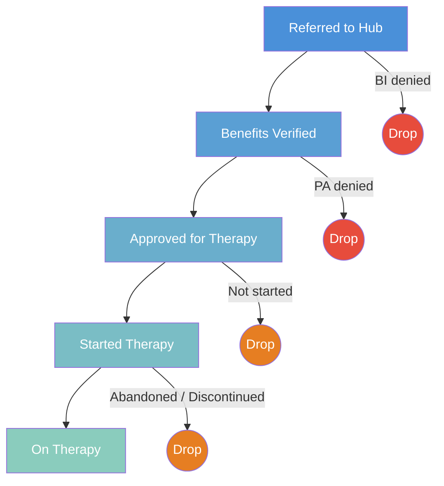

---

## HCP Stories

### Dr. Lisa Thornton — High Volume, Gradual Erosion

The highest-volume hub user in the territory. Referrals are booming but cracks are showing at scale.

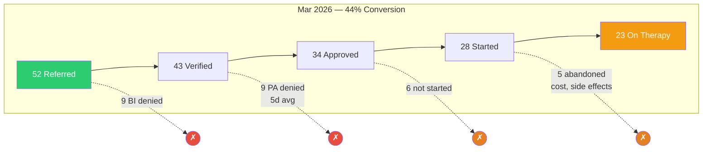

| Period | Referred | Verified | Approved | Started | On Tx | Persistency |
|---|---|---|---|---|---|---|
| Oct 2025 | 22 | 18 | 14 | 10 | 9 | 0.90 |
| Dec 2025 | 32 | 27 | 22 | 18 | 16 | 0.89 |
| Jan 2026 | 40 | 34 | 27 | 22 | 19 | 0.86 |
| Mar 2026 | 52 | 43 | 34 | 28 | 23 | 0.82 |

**PA detail:** 2 → 2 → 3 → 5 denied | Avg days to decision: 5 → 4 → 4 → 5
**Copay:** 8 → 15 → 18 → 22 enrolled | Avg OOP reduction: $2,800 → $3,400
**Abandonment:** 1 → 2 → 3 → 5 | Reasons: cost concerns, side effects, relocated

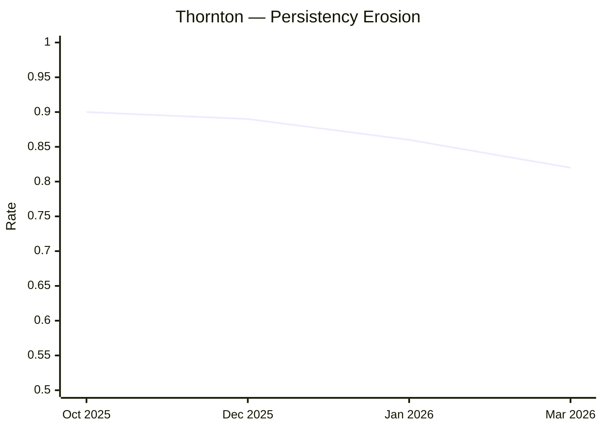

**Story:** The funnel looks healthy at the top — 52 referrals in Mar 2026. But persistency dropped from 0.90 to 0.82 (below the 85% warning threshold). PA denials increased from 2 to 5. Abandonment reasons are diversifying — cost, side effects, relocation. This is the "growing pains" narrative: success at scale reveals process cracks that didn't show when volume was small.

**LWC signals:** Low Persistency (0.82), Patient Abandonment (5)

---

### Dr. Matthew Wong — Funnel Collapse

The most dramatic deterioration in the territory. The funnel progressively narrows to near-zero output.

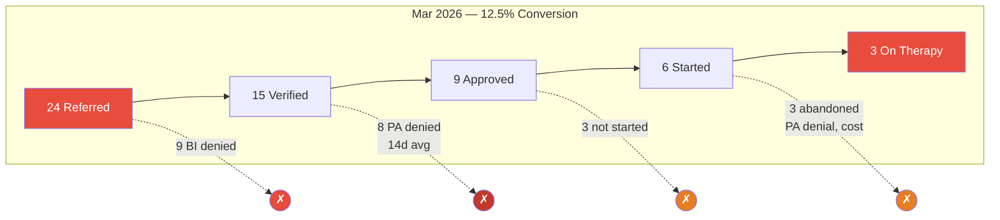

| Period | Referred | Verified | Approved | Started | On Tx | Persistency |
|---|---|---|---|---|---|---|
| Oct 2025 | 15 | 11 | 8 | 6 | 6 | 0.92 |
| Dec 2025 | 20 | 14 | 10 | 8 | 6 | 0.75 |
| Jan 2026 | 22 | 14 | 9 | 7 | 5 | 0.71 |
| Mar 2026 | 24 | 15 | 9 | 6 | 3 | **0.50** |

**PA detail:** 2 → 3 → 5 → **8 denied** | Avg days to decision: 7 → 9 → **11** → **14**
**Copay:** 5 → 5 → 4 → 2 enrolled | Avg OOP reduction: $2,500 → $2,000
**Abandonment:** 0 → 2 → 2 → 3 | Reasons: PA denial → switched to competitor, cost, cost burden after copay card max

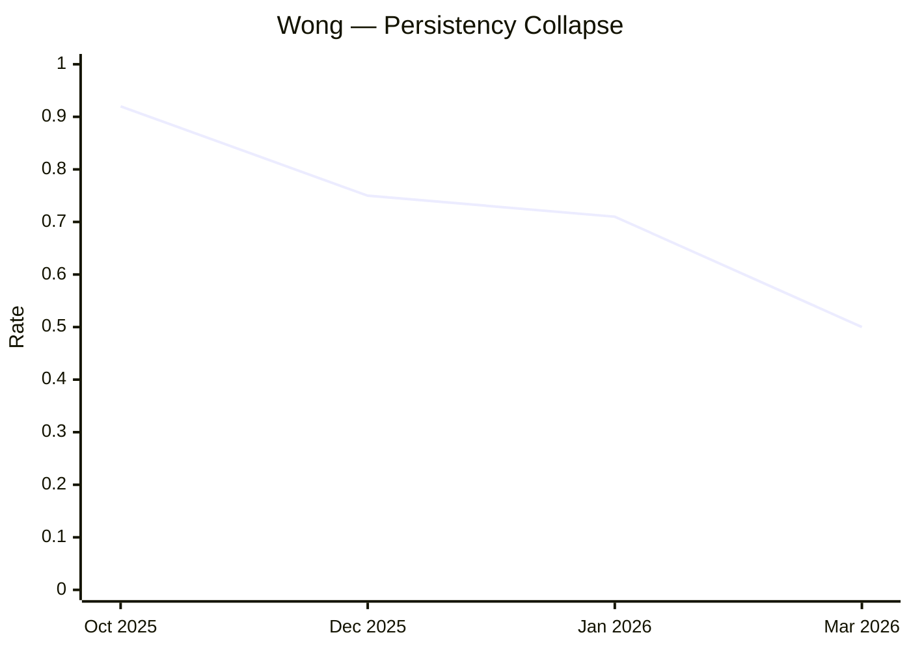

**Story:** Referrals still coming in (24 in Mar) but almost nothing makes it through. Persistency cratered from 0.92 to 0.50 in 6 months. PA denials accelerated from 2 to 8, and PA processing time doubled from 7 to 14 days — payers are making it harder as his colitis events become known. Copay enrollment dropped from 5 to 2 as patients discontinued. Abandonment reasons explicitly reference PA denial and cost burden. The funnel chart will show a massively pinched shape — wide top, near-empty bottom.

**LWC signals:** Low Persistency (error — 0.50 < 70%), High PA Denial Rate (8/24 = 33%), Patient Abandonment (3), Low Funnel Conversion (12.5% < 35%), PA Processing Delay (14 days > 10)

---

### Dr. Kevin Patel — Formulary-Constrained Funnel

Small funnel with formulary-driven barriers, but slowly improving as exception requests succeed.

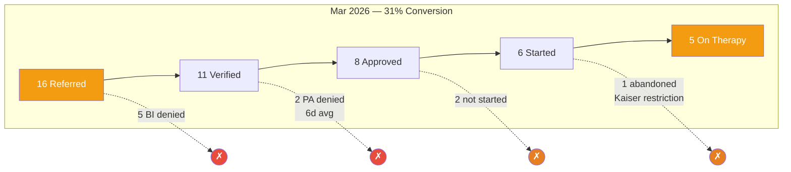

| Period | Referred | Verified | Approved | Started | On Tx | Persistency |
|---|---|---|---|---|---|---|
| Oct 2025 | 5 | 3 | 2 | 1 | 1 | 1.00 |
| Dec 2025 | 8 | 5 | 3 | 2 | 1 | 0.50 |
| Feb 2026 | 12 | 8 | 5 | 4 | 3 | 0.75 |
| Mar 2026 | 16 | 11 | 8 | 6 | 5 | 0.83 |

**PA detail:** 1 → 2 → 2 → 2 denied | Avg days to decision: **14** → 10 → 8 → 6
**Copay:** 1 → 1 → 3 → 5 enrolled | Avg OOP reduction: $2,600 → $2,800
**Abandonment:** 0 → 1 → 1 → 1 | Reasons: Kaiser formulary restriction, step therapy required, patient remained on Onclaris

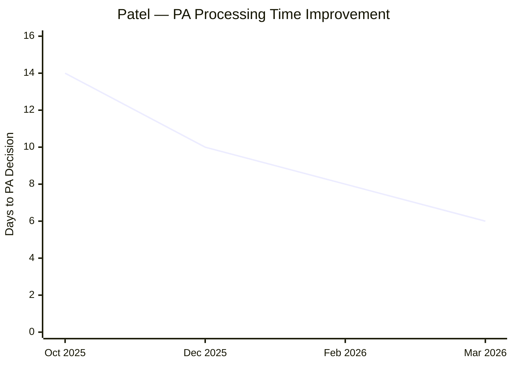

**Story:** Kaiser's step therapy requirement creates consistent friction — every period has 1-2 PA denials and at least 1 abandonment explicitly citing Kaiser restrictions. But the trajectory is positive: PA processing time dropped from 14 to 6 days, copay enrollment grew from 1 to 5, and persistency recovered from 0.50 to 0.83. The hub is getting better at navigating Kaiser exceptions. Referrals tripled (5 → 16), showing growing HCP interest despite the barrier.

**LWC signals:** Patient Abandonment (Kaiser-driven), PA Processing Delay (14 days initially)

---

### Dr. Brian Sullivan — Perfect Small Funnel

The smallest funnel but the cleanest. Every patient who enters makes it through.

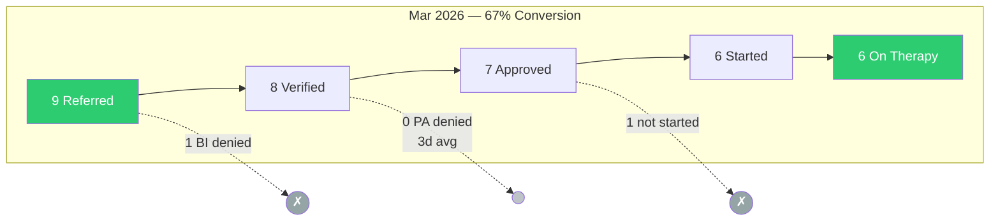

| Period | Referred | Verified | Approved | Started | On Tx | Persistency |
|---|---|---|---|---|---|---|
| Oct 2025 | 3 | 2 | 2 | 1 | 1 | **1.00** |
| Jan 2026 | 6 | 5 | 4 | 3 | 3 | **1.00** |
| Mar 2026 | 9 | 8 | 7 | 6 | 6 | **1.00** |

**PA detail:** 0 → 0 → 0 denied | Avg days to decision: 5 → 4 → 3
**Copay:** 1 → 3 → 6 enrolled | Avg OOP reduction: $2,900 → $3,100
**Abandonment:** 0 → 0 → 0

**Story:** 100% persistency across all periods. Zero PA denials, zero abandonment. PA decision time getting faster (5 → 3 days). Every patient enrolled gets copay assistance. The funnel chart will show a nearly cylindrical shape — minimal drop-off at every stage. This proves that when access works, patients stick. The challenge isn't retention — it's getting Dr. Sullivan to refer more patients. He's an Onclaris loyalist with 14-17 TRx/month and only 1-2 Immunonco scripts.

**LWC signals:** Strong Hub Performance (100% persistency, no abandonment, >90% PA approval)

---

### Dr. Nina Chandra — VA Ramp with Late Friction

Fast-growing funnel with VA frictionless access, but late-stage attrition emerging despite zero PA barriers.

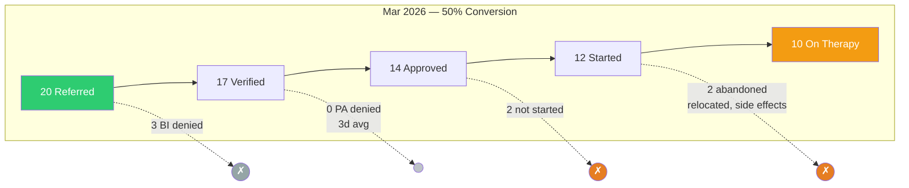

| Period | Referred | Verified | Approved | Started | On Tx | Persistency |
|---|---|---|---|---|---|---|
| Nov 2025 | 6 | 5 | 4 | 3 | 3 | 1.00 |
| Jan 2026 | 14 | 12 | 10 | 8 | 7 | 0.88 |
| Mar 2026 | 20 | 17 | 14 | 12 | 10 | 0.83 |

**PA detail:** 0 → 0 → 0 denied | Avg days to decision: 3 → 3 → 3
**Copay:** 2 → 6 → 9 enrolled | Avg OOP reduction: $2,700 → $3,000
**Abandonment:** 0 → 1 → 2 | Reasons: relocated, side effects

**Story:** Started perfect but scaling introduced attrition. No PA barriers at all (VA system), so the abandonment must come from other sources — the reasons cite relocation and side effects (correlates with her Grade 3 colitis event in Mar 2026). Persistency dropped from 1.00 to 0.83. Referrals tripled from 6 to 20, showing aggressive adoption. Compare with Dr. Sullivan: both started near-perfect, but Sullivan stayed at 100% with small volume while Chandra's larger scale introduced tolerability-driven attrition.

**LWC signals:** Low Persistency (0.83 — borderline warning), Patient Abandonment (2)

---

## Territory Funnel Comparison

```mermaid
xychart-beta
    title "Territory — Latest Period Funnel Conversion"
    x-axis ["Thornton", "Wong", "Patel", "Sullivan", "Chandra"]
    y-axis "Patients" 0 --> 55
    bar "Referred" [52, 24, 16, 9, 20]
    bar "On Therapy" [23, 3, 5, 6, 10]
```

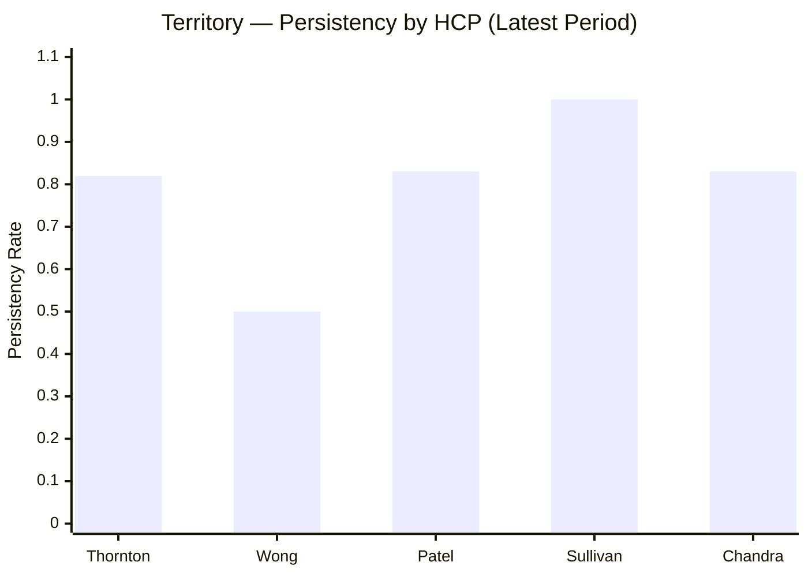

| HCP | Latest Referrals | Conversion % | Persistency | PA Denials | Abandonment | Primary Issue |
|---|---|---|---|---|---|---|
| Lisa Thornton | 52 | 44% | 0.82 | 5 | 5 | Scaling pressure |
| Matthew Wong | 24 | 12.5% | 0.50 | 8 | 3 | Safety/access collapse |
| Kevin Patel | 16 | 31% | 0.83 | 2 | 1 | Kaiser formulary |
| Brian Sullivan | 9 | 67% | 1.00 | 0 | 0 | Volume (not retention) |
| Nina Chandra | 20 | 50% | 0.83 | 0 | 2 | Late tolerability |

**Territory total (latest period):** 121 referred → 47 on therapy = **39% conversion**, avg persistency **0.80**

---

## How to Load

```apex
DemoDataLoader.loadScenario('demo_patient_journey_oncology_usw_sf');
```

The D3.js funnel chart requires the `d3js` static resource to be deployed. The component uses `lwc:dom="manual"` for direct DOM manipulation of the SVG funnel.
